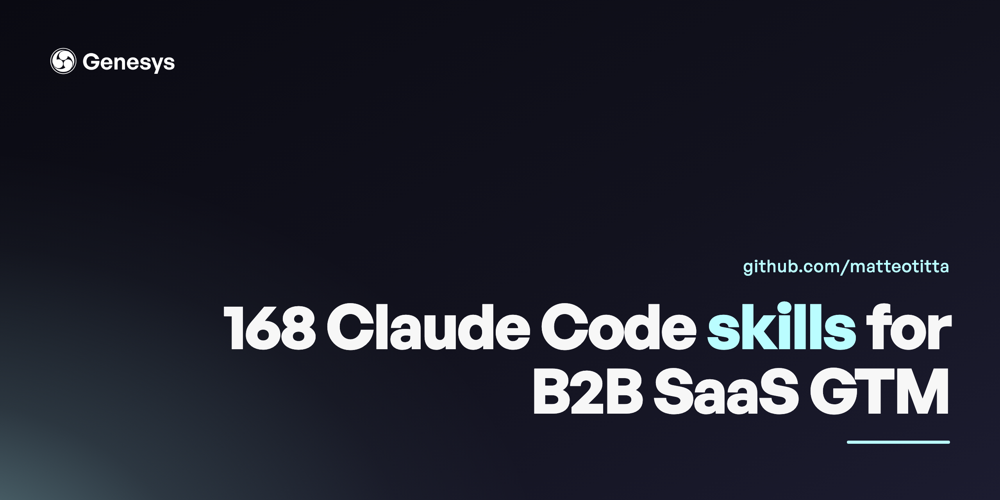

# genesys-skills

   

**Production Claude Code skills for B2B SaaS go-to-market.** This is the actual skill library I use to run GTM for B2B SaaS founders — content, outbound, paid, SEO/AEO, social, PMM, sales enablement, lifecycle, plus the meta-tooling that keeps 168 skills coherent. Shared, and updated, weekly.

Built by [Matteo Titta](https://github.com/matteotitta) — AI-pilled GTM operator, founder of [Genesys Growth](https://genesysgrowth.com).

## What's inside — 168 skills across 13 GTM primitives

| Primitive | Skills | Covers |
|---|---:|---|
| social | 20 | LinkedIn, newsletter, YouTube, X — post systems & repurposing |
| outbound | 17 | list-building, signal research, prospecting loops |
| website | 12 | site architecture, copy, build, audits, analytics plans |
| product-marketing | 12 | positioning, messaging, launches, event pipelines |
| content | 11 | long-form, technical papers, motion/video, UI frames |
| paid-marketing | 10 | Google & LinkedIn ad copy, teardowns, weekly ops |
| sales-enablement | 8 | one-pagers, call coaching, sales tracks, revops |
| clients | 7 | onboarding, consultation, proposals, contract redline, hiring |
| seo-aeo | 6 | SEO + answer-engine optimization content |
| design | 5 | dashboards, decks, brand-mapped assets |
| lifecycle | 4 | help center, referral, in-app |
| product-management | 4 | strategy docs, research |
| ops | 1 | company / CFO ops |
| **meta** | 37 | orchestration, session, catalog, learning, infra — the tooling that runs the library |
| **research** | 14 | ICP, competitor, win-loss, company context, brand kit |

Plus `_schema/` — the authoring SOP, frontmatter schema, and output templates that keep every skill consistent and CI-validatable.

## How to use
1. Browse a primitive and open its `SKILL.md`.
2. Drop the skill folder into your own `.claude/skills/` to run it in Claude Code — or just read it as a playbook.
3. Fork it, adapt it to your stack, ship it.

New to Claude Code for GTM? Start with [claude-code-marketing-quickstart](https://github.com/matteotitta/claude-code-marketing-quickstart).

## What's included (and what isn't)
This is the **methodology** layer — every skill's `SKILL.md`. To keep client work confidential, the `references/` worked-examples and internal assets are **not** part of this public release, so a few in-skill links point to files you won't find here — the skills read as complete playbooks regardless. Skills also reference an internal workspace layout (`.claude/rules/`, `references/`, MCP tool names); treat those as adapt-to-your-own pointers.

## License
[MIT](LICENSE) — use them, fork them, ship them. Attribution appreciated, not required.

---
More: [awesome-claude-code-for-gtm](https://github.com/matteotitta/awesome-claude-code-for-gtm) · [awesome-gtm-mcp-servers](https://github.com/matteotitta/awesome-gtm-mcp-servers) · [genesysgrowth.com](https://genesysgrowth.com)
